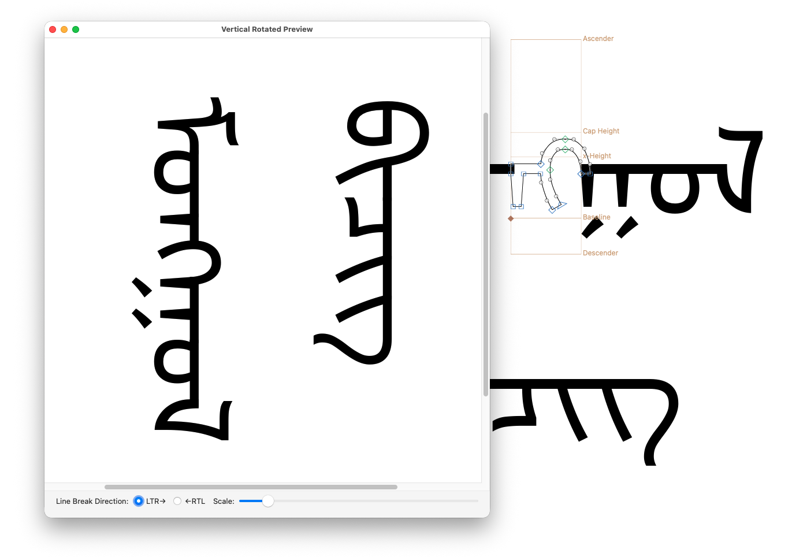

# VerticalRotatedPreview.glyphsPlugin

This is a window plugin for the [Glyphs font editor](http://glyphsapp.com/) that shows the Edit View’s contents in vertical rotated mode.
It was developed to make vertical writing systems like Mongolian easier.
After installation, it will add the menu item *Window > Vertical Rotated Preview*.

### Installation

1. Open the Plugin Manager in Glyphs and look for “Vertical Rotated Preview”.
2. Relaunch Glyphs for the plugin to be loaded.

The plugin will appear in Window > Vertical Rotated Preview.

### License

Copyright 2026 Toshi Omagari(@tosche_e).

Licensed under the [Apache License, Version 2.0](http://www.apache.org/licenses/LICENSE-2.0) (the “License”); you may not use this file except in compliance with the License. See the License file included in this repository for further details.